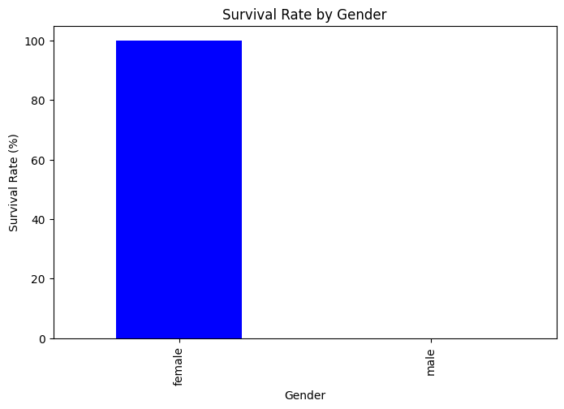
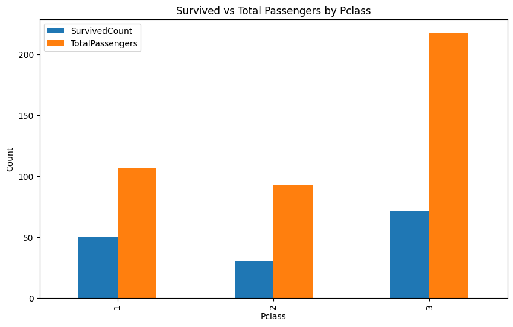
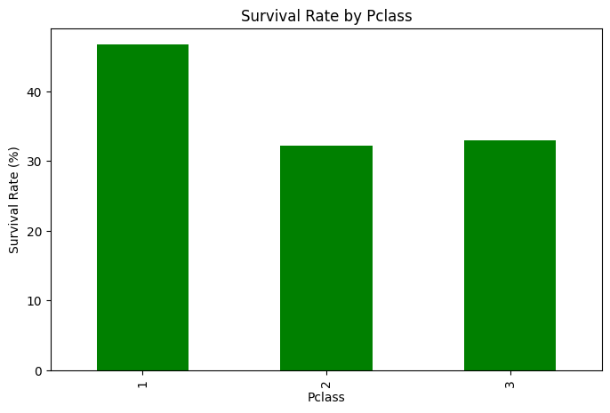

# Titanic Data Analysis Project

## Project Overview
This project analyzes the Titanic dataset to explore survival rates based on passenger class (`Pclass`) and gender (`Sex`). The analysis is performed in a Google Colab notebook.

## Colab Notebook Link
[Google Colab Notebook](https://colab.research.google.com/drive/15dGuUr4phT-mJBD5KobUJCBTrmy57sWZ?usp=sharing)

## Tasks Performed
1. **Data Aggregation**: Grouped data by `Pclass` and `Sex` to calculate:
   - Total Passengers.
   - Number of Survivors.
   - Survival Rate.

2. **Visualizations**:
   - **Overall Survival Data**: Bar chart showing total survivors vs non-survivors.
   - **Survival by Gender**: Bar chart comparing survival rates of male and female passengers.
   - **Survival by Passenger Class (Pclass)**: Bar chart comparing survival rates across passenger classes.

## Visualizations

### Survival by Gender

### Survival by Passenger Class (Pclass)

## Set Up and Run
- Open the Colab Notebook using the link above.
- Run the cells to see data aggregation and visualizations.

